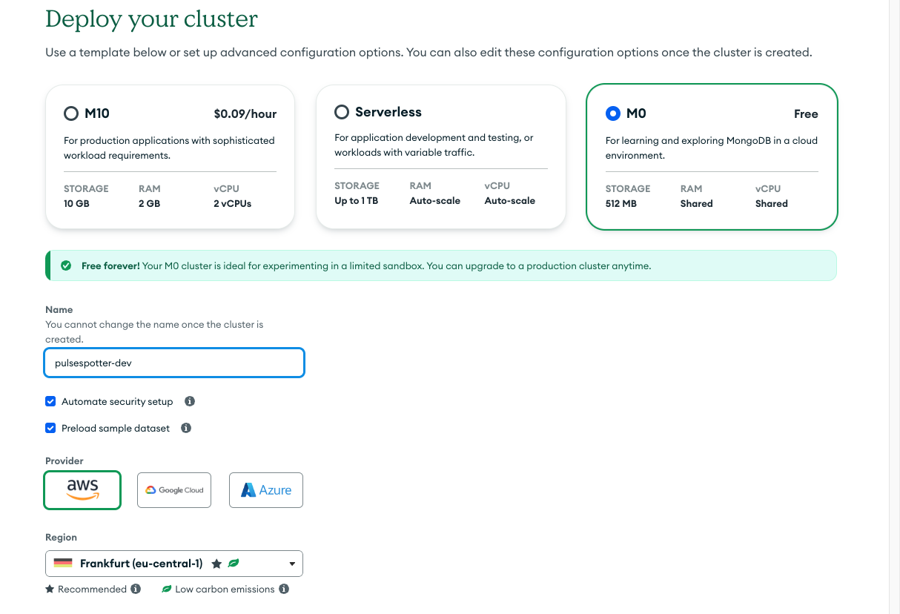

## Create new accounts for services used by PulseSpotter

### MongoDB
- Go to https://account.mongodb.com/account/register and create a new MongoDB Atlas account.
- Verify your account.
- Sign in to MongoDB Atlas using your new account. https://account.mongodb.com/account/login
- Optional: Add MFA for better security.
- By default you will have one project "Project 0" in your overview page. Feel free to go to the project settings and rename it to whatever name you like.

- Create a new cluster:
  - MongoDB offers a free cluster with 512MB of storage which should be enough for small-sized use cases.
  - Set a name for your database and save it in an `.env` file under the `MONGO_DATABASE` key.

  - You will be asked to save the username and password which will be needed in order to connect to the database but also to link the application with the database. Click on "Create Dabase User" and then on "Choose a connection method".

  - Choose the "Compass" option if you have MongoDB Compass installed.
  - Copy the connection string and paste it a `.env` file under the `MONGO_HOST` key.

### Qdrant
- Go to https://cloud.qdrant.io/login and sign in with your Google account.
- You'll be redirected to your overview page.

- Press on the "Create" button to create a new cluster that will host your vector database.
- You'll be prompted with a view similar to the one in the following image.

- Qdrant offers a free cluster for small-sized use cases. Press on the "Free" option and then press on the "Create" button at the bottom of your screen.

- Click on the "..." button and then on the "Details" option.
- Find the cluster "Endpoint", copy it and save it in an `.env` file under the `QDRANT_HOST` key.
- On the same page, find and click on the "API keys" tab. Create a new API key, copy it and save in an `.env` file under the `QDRANT_API_KEY` key.

### ZenRows
- Go to https://app.zenrows.com/login and create a new ZenRows account.
- Choose from a variety of different pricing plans. https://app.zenrows.com/plans
- Go to https://app.zenrows.com/builder, find your API key, copy it and save it in an `.env` file under the `ZENROWS_API_KEY` key.

### OpenAI
- Go to https://openai.com/index/openai-api/ and create a new account or login to an existing one.
- Create an API key, copy it save it in an `.env` file under the `OPENAI_API_KEY` key.
