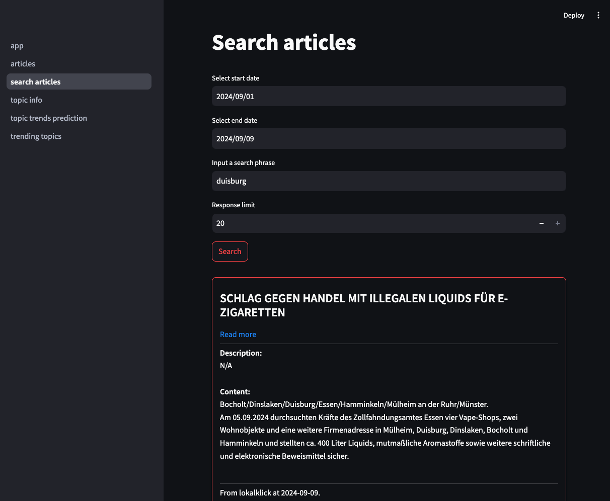

# Walkthrough

## Launching the application
Make sure you successfully built the application:
- [Build with Docker](build-with-docker.md)

After building the application you can access it in your browser by simply visiting: 
```bash
http://localhost:8501
```
in your browser.

## Accessing the API
PulseSpotter uses FastAPI for the API development. This way API documentation is automatically generated and can
be accessed by visiting
```bash
http://localhost:8000/docs
```
in your browser.

You can use the API to interact with your application programmatically or integrate it into other services.

## Interacting with the web interface

You can access the web interface at http://localhost:8501/. A homepage should be displayed and a navigation menu you
can interact with to choose between different features PulseSpotter has to offer.

### Trending Topics Overview
This page lets the user choose from a list of weeks. By default, the most recent week is displayed and chosen for the
user. The purpose of this page is to give an overview of extracted topics and present statistics for ones which are 
outstanding in terms of the overall number of articles that are part of each topic.


The page shows the most popular topics extracted from the underlying data. At the top a pie chart is displayed with 
a percentage-wise breakdown of the popularity of each displayed topic. Just below a list of topics is presented with 
information such as:
- The assigned topic label - Generated by prompting OpenAI's GPT model with a sample of articles for each topic and letting the model providing the topic summary.
- Number of articles - Raw number of articles that are part of this topic in the selected week.
- Link to topic info page - For each displayed topic a link is provided if the user wants to see more information about a topic.

### Trending Topics Predictions
This page uses a pretrained topic trends prediction model trained on custom data that is able to provide a prediction
for next week as to which topics are expected to be trending. A prediction is generated by using topics identified in the
previous week and then ranking each by a yielded trending topic probability score. The probability score is predicted by
the model utilising information about each topic such as the contextual representation of topics (a topic embedding
derived from embedding articles that are part of each topic) and a temporal representation of topics (representing the
trend of article counts through the week as an embedding). If you're interested in understanding the algorithm better
please visit [PulseSpotter under-the-hood](algo.md).


The page contains similar UI components as the [Trending Topics Overview](#trending-topics-overview) page.

### Topic Info Page
Users are navigated to this page either through the :
- [Trending Topics Overview page](#trending-topics-overview)
- [Trending Topics Predictions page](#trending-topics-predictions)

In both cases users clicked on the "See more" button of a certain topic.

The "Topic Info" page aims to provide more information about each extracted topic. At the very top, users are 
given navigation links to return to either the [Trending Topics Overview page](#trending-topics-overview) or 
the [Trending Topics Predictions page](#trending-topics-predictions).


Just below, the topic label, topic start and end dates are given followed by a graph that displays the trend in 
articles count through the week in which the topic was extracted in.


Below is a component that enables users to navigate through the articles by selecting the date and listing out the
articles in pages (as many as there are based on the number of articles).

### Articles Info Page
Users are navigated to this page either through the :
- [Topics Info page](#topic-info-page)
- [Search articles page](#searching-articles)


This page provides more information about each article that is ingested into PulseSpotter.
Article information is separated into several components:
- Basic information - the title, summary, published date and a link to the original article.
- Topic assignment - information about which topic the article is assigned to and with which probability.
- Content - Full article content.
- Displaying similar articles - Articles that have a similar content to the selected article are listed as the last 
component of this page ranked by the similarity of each article to the selected article.

#### Displaying similar articles
PulseSpotter contains an efficient vector database as part of the backend that enables
efficient similarity search queries. This way users have a nice way to explore a certain story be going through
all articles that talk about the same (or similar) things.


### Searching articles
PulseSpotter offers users the ability to query the articles database by providing a custom date range and a search
phrase. Combined with the ability [to list similar articles](#displaying-similar-articles) these features are aimed
to enhance the journalist research in order to get the full overview about a story of interest. 



